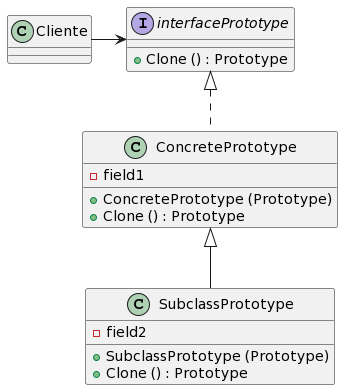
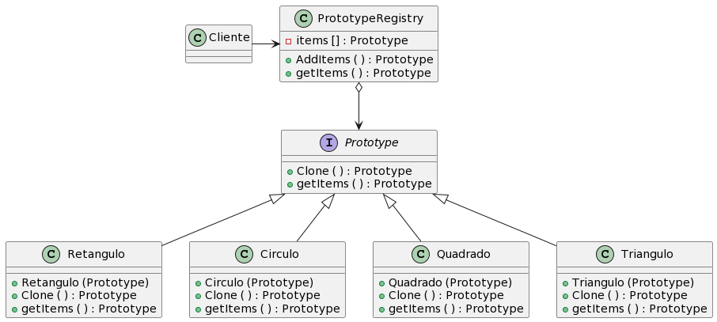

# Prototype

## Definição

Em padrões de projeto na programação orientada a objetos, o termo "prototype" refere-se a um padrão que se concentra na criação de objetos por meio da clonagem de um objeto existente, conhecido como "protótipo". 

## Intenção

O padrão Prototype tem como objetivo criar novos objetos a partir de objetos existentes, conhecidos como protótipos, em vez de criar novos objetos do zero. Isso é útil quando a criação de um objeto é custosa em termos de desempenho ou quando os objetos têm uma estrutura complexa.

O padrão Prototype permite que um objeto seja clonado para criar um novo objeto. O objeto original, chamado de protótipo, serve como modelo para a criação de cópias. A clonagem pode ser superficial (apenas copiando as propriedades básicas) ou profunda (copiando todas as propriedades e objetos internos).

## Motivação

Em um sistema de modelagem 3D (exemplo), a criação de novos objetos tridimensionais a partir do zero é demorado devido a sua complexidade. Suponhamos que temos que criar vários objetos (Círculos, Triângulos, etc.) e cada objeto distinto venha levar 30 minutos para ser criado, depois de criado, precisaremos criar mais 10 objetos do mesmo tipo por uma necessidade especifica, isso levaria muito tempo, certo? Então, como solucionar esse problema?
Podemos solucionar esse problema copiando a parti de um objeto existente, outros objetos do mesmo tipo com o padrão chamado Prototype.

No exemplo acima, podemos observar o cliente criando um novo objeto com base em um objeto existente. A interface `Prototype` define a interface e inclui o método 'clonar'. A classe `ConcretePrototype` implementa a interface `Prototype` e é capaz de clonar a si mesma."

## Aplicabilidade

Use o prototype, quando: 
Em situações em que você deseja criar cópias de objetos existentes de maneira eficiente e personalizá-las conforme necessário. Aqui estão algumas situações específicas em que o padrão Prototype é útil em Java:

1.	Criação de objetos complexos
2.	Variações de objetos
3.	Preservação de estados
4.	Reciclagem de objetos
5.	Evitar hierarquias de subclasses

É importante lembrar que o uso do padrão Prototype em Java é mais eficaz quando você deseja criar cópias de objetos existentes, especialmente quando a criação desses objetos é um processo caro.

## Estrutura - Implementação Básica

    
## Estrutura - Implementação do Registo do Prototype


É uma forma fácil de acessar protótipos que você usa de forma frequente, ele salva um conjunto de protótipos pré construído que estavam prontos para serem copiado.

## Participantes

* Prototype (Protótipo): Define a interface para clonar objetos e geralmente inclui um método "clone".
* ConcretePrototype (Protótipo Concreto): Implementa a interface Prototype e fornece a implementação específica para clonar a si mesmo.
* Client (Cliente): Cria novos objetos clonando um protótipo existente, em vez de criar novos objetos do zero.

## Colaborações

*	O padrão Prototype é um padrão de design de software que faz parte do grupo de padrões de criação. Ele é usado para criar novos objetos duplicando um objeto existente, conhecido como protótipo, em vez de criar um novo objeto do zero. Isso pode ser útil quando a criação de um objeto é mais custosa em termos de desempenho ou recursos do que a clonagem de um objeto existente.

*	A colaboração básica envolve o cliente solicitando à fábrica de protótipos um novo objeto, especificando qual protótipo deseja. A fábrica de protótipos, por sua vez, cria uma cópia do protótipo solicitado e a retorna ao cliente. O cliente pode então usar o objeto clonado conforme necessário.

## Consequências

### __Vantagens__

*	Você pode clonar objetos sem acoplá-los a suas classes concretas.
*	Você pode se livrar de códigos de inicialização repetidos em troca de clonar protótipos pré-construídos.
*	Você pode produzir objetos complexos mais convenientemente.
*	Você tem uma alternativa para herança quando lidar com configurações pré determinadas para objetos complexos.

### __Desvantagem__

*	Clonar objetos complexos que têm referências circulares pode ser bem complicado.


_Exemplo de referências circulares:_

```java

class Departamento {
private String nome;
    private List<Funcionario> funcionarios;
    public Departamento(String nome) {
        this.nome = nome;
        this.funcionarios = new ArrayList<>();
    }
    public void adicionarFuncionario(Funcionario funcionario) {
        funcionarios.add(funcionario);
    }
}
class Funcionario {
    private String nome;
    private Departamento departamento;
    public Funcionario(String nome, Departamento departamento) {
        this.nome = nome;
        this.departamento = departamento;
    }
}

```
## Implementações

A implementação do padrão Prototype envolve a criação de uma classe que atua como protótipo e permite a clonagem de objetos com base nesse protótipo. O Java fornece uma interface `Cloneable` e o método `clone()` para facilitar a criação de objetos clonáveis. 

*	Criamos uma interface Prototype marcada com a interface Cloneable.
*	Implementamos a classe ConcretePrototype, que implementa a interface Prototype e fornece uma implementação do método `clone()`. Este método cria uma cópia profunda do objeto, criando uma nova instância com os mesmos valores dos atributos.
*	No main(), criamos um objeto protótipo e, em seguida, clonamos esse protótipo para criar uma cópia. Modificamos a cópia e verificamos que as modificações não afetam o objeto original.

O padrão Prototype permite criar cópias de objetos de maneira flexível e eficiente, evitando a necessidade de criar novas instâncias a partir de classes concretas. Isso é especialmente útil quando a configuração de objetos é complexa ou quando você deseja evitar a duplicação de código de inicialização.

## Exemplo de Código - OBJETO3D - Com Cloneable
```java
class Objeto3D implements Cloneable {
    private String tipo;
    private String cor;

 public Objeto3D() {
        this.tipo = "Objeto 3D";
        this.cor = "Branco";
    }
    
public void setCor(String cor) {
        this.cor = cor;
    }
 
@Override
    public Objeto3D clone() throws CloneNotSupportedException {
        return (Objeto3D) super.clone();
    }
   
 @Override
    public String toString() {
        return "Tipo: " + tipo + ", Cor: " + cor;
    }
}

class Cubo extends Objeto3D {
    private String tipo = "Cubo";
    private double largura;
    private double altura;
    private double profundidade;
    
public Cubo() {
        super();
        this.largura = 1;
        this.altura = 1;
        this.profundidade = 1;
    }
    
@Override
    public String toString() {
    return super.toString() + ", Largura: " + largura + ", Altura: " + altura + ", Profundidade: " + profundidade;
    }
}

class Esfera extends Objeto3D {
    private String tipo = "Esfera";
    private double raio;

    public Esfera() {
        super();
        this.raio = 0.5;
    }

    @Override
    public String toString() {
    return super.toString() + ", Raio: " + raio;
    }
}

public class Main {
    public static void main(String[] args) {

        Cubo prototipoCubo = new Cubo();
        Esfera prototipoEsfera = new Esfera();

        try {

            Cubo cubo1 = prototipoCubo.clone();
            Cubo cubo2 = prototipoCubo.clone();
            cubo2.setCor("Azul");

            Esfera esfera1 = prototipoEsfera.clone();
            Esfera esfera2 = prototipoEsfera.clone();
            esfera2.setCor("Vermelho");

            System.out.println(cubo1);
            System.out.println(cubo2);
            System.out.println(esfera1);
            System.out.println(esfera2);
        } catch (CloneNotSupportedException e) {
            e.printStackTrace();
        }
    }
}
```

## Exemplo de Código - OBJETO3D - Sem Cloneable

```java

class Objeto3D {
    private String tipo;
    private String cor;
 
 public Objeto3D() {
        this.tipo = "Objeto 3D";
        this.cor = "Branco";
    }

 public void setCor(String cor) {
        this.cor = cor;
    }
 
public Objeto3D clonar() {
        Objeto3D clone = new Objeto3D();
        clone.tipo = this.tipo;
        clone.cor = this.cor;
        return clone;
    }

@Override
    public String toString() {
        return "Tipo: " + tipo + ", Cor: " + cor;
    }
}

class Cubo extends Objeto3D {
    private String tipo = "Cubo";
    private double largura;
    private double altura;
    private double profundidade;

    public Cubo() {
        super();
        this.largura = 1;
        this.altura = 1;
        this.profundidade = 1;
    }

    @Override
    public Objeto3D clonar() {
        Cubo clone = new Cubo();
        clone.setCor(this.getCor());
        clone.largura = this.largura;
        clone.altura = this.altura;
        clone.profundidade = this.profundidade;
        return clone;
    }

    @Override
    public String toString() {
        return super.toString() + ", Largura: " + largura + ", Altura: " + altura + ", Profundidade: " + profundidade;
    }
}

class Esfera extends Objeto3D {
    private String tipo = "Esfera";
    private double raio;

    public Esfera() {
        super();
        this.raio = 0.5;
    }

@Override
    public Objeto3D clonar() {
        Esfera clone = new Esfera();
        clone.setCor(this.getCor());
        clone.raio = this.raio;
        return clone;
    }

    @Override
    public String toString() {
        return super.toString() + ", Raio: " + raio;
    }
}

public class Main {
    public static void main(String[] args) {
        Cubo prototipoCubo = new Cubo();
        Esfera prototipoEsfera = new Esfera();

        Cubo cubo1 = (Cubo) prototipoCubo.clonar();
        Cubo cubo2 = (Cubo) prototipoCubo.clonar();
        cubo2.setCor("Azul");

        Esfera esfera1 = (Esfera) prototipoEsfera.clonar();
        Esfera esfera2 = (Esfera) prototipoEsfera.clonar();
        esfera2.setCor("Vermelho");
        System.out.println(cubo1);
        System.out.println(cubo2);
        System.out.println(esfera1);
        System.out.println(esfera2);
    }
}

```
## Usos conhecidos

Talvez o primeiro exemplo do padrão Prototype se encontre no sistema Sketchpad de Ivan Sutherland [Sut63]. A primeira aplicação amplamente conhecida do padrão numa linguagem orientada a objeto foi em ThingLab, na qual os usuários poderiam formar um objeto composto e então promovê-lo a um protótipo pela sua instalação numa biblioteca de objetos reutilizáveis [Bor81]. 

Goldberg e Robson mencionam protótipos como um padrão [GR83], mas Coplien [Cop92] fornece uma descrição muito mais completa. Ele descreve idiomas relacionados ao padrão prototype para C++ e dá muitos exemplos e variações. O Etgdb é um depurador (debugger) de front-end, baseado em ET++, que fornece uma interface de apontar e clicar para diferentes depuradores orientados a linhas. Cada depurador tem uma subclasse DebuggerAdaptor correspondente. Por exemplo, GdbAdaptor adapta o etgdb à sintaxe dos comandos do gdb de GNU, enquanto que SunDbxAdaptor adapta o etgdb ao depurador da Sun. 

O Etgdb não tem um conjunto de classes DebuggerAdaptor codificadas rigidamente nele próprio. Em vez disso, lê o nome do adaptor a ser usado de uma variável fornecida pelo ambiente, procura um protótipo com o nome especificado em uma tabela global e, então, clona o protótipo. 
Novos depuradores podem ser acrescentados ao etgdb ligando-o ao DebuggerAdaptor que funciona para um depurador novo. 

A “biblioteca de técnicas de interações”, no ModeComposer, armazena protótipos de objetos que suportam várias técnicas de interação [Sha90]. Qualquer técnica de interação criada pelo Mode Composer pode ser usada como um protótipo colocando-a nesta biblioteca. O padrão Prototype permite ao Mode Composer suportar um conjunto ilimitado de técnicas de interação. O exemplo do editor musical discutido anteriormente se baseia no framework para desenhos do Unidraw [VL90].

## Padrões Relacionados

Prototype e Abstract Factory (95) são padrões que competem entre si em várias situações, como discutimos no final deste capítulo. Porém, eles também podem ser usados em conjunto. Um Abstract Factory pode armazenar um conjunto de protótipos a partir dos quais podem ser clonados e retornados objetos-produto.

## Referencias

Gamma Erich - Padrões de Projetos - Soluções Reutilizáveis <br/>
Mergulho nos Padrões de Projeto
